# Tatjana Marković Frontend Mentor Crowdfunding product page

## Table of contents

  - [Overview](#overview)
  - [The challenge](#the-challenge)
  - [Screenshot](#screenshot)
  - [Links](#links)
  - [My process](#my-process)
  - [Built with](#built-with)
  - [Author](#author)

## Overview
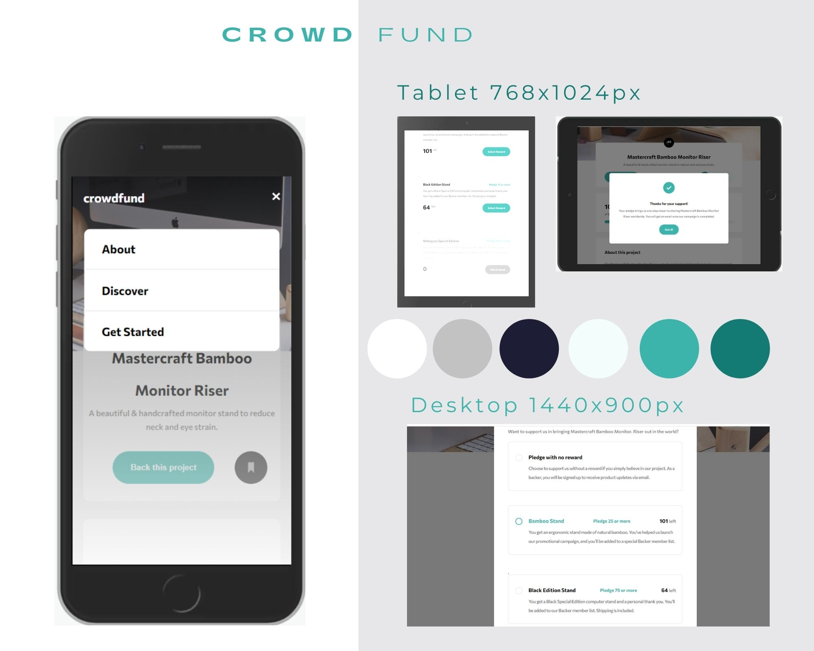
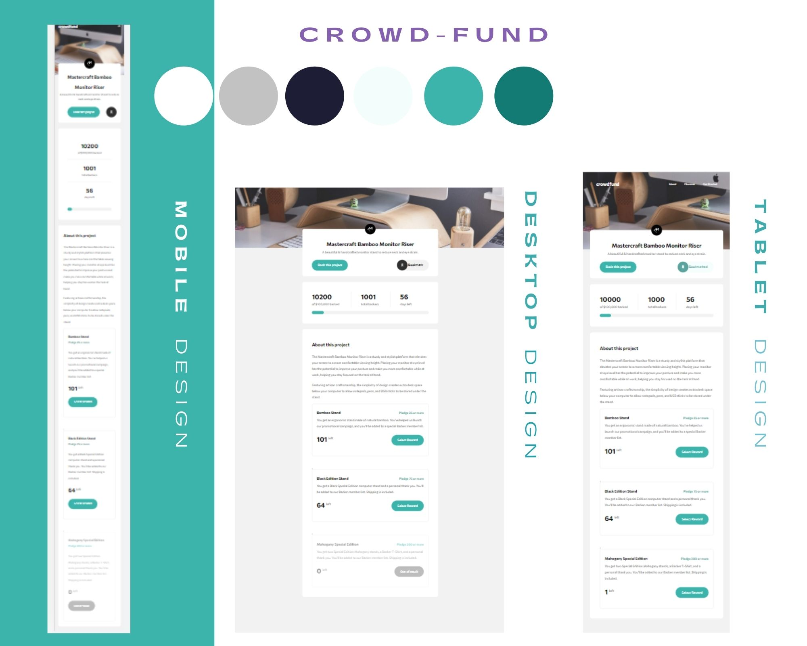

- On first load
  1. Show Initial Values 

- App behavior
  1. User can choose how to pledge project with or without reward. 
      -  With reward -User have to pledge minimum value for that reward,
      -  No reward - any values 
  2. When some rewards are not available ( = 0), user can't choose it anymore and this item is shown as faded.
  3. When user successfully pledge minimum value thanks message is shown.
  4. The reward stock is reduced by one, new backer is added, pledge amount is increased by new pledge, and slider is updated accordingly

## The challenge

Your challenge is to build out this crowdfunding product page and get it looking as close to the design as possible.

Your users should be able to:

- View the optimal layout depending on their device's screen size
- See hover states for interactive elements
- Make a selection of which pledge to make
- See an updated progress bar and total money raised based on their pledge total after confirming a pledge
- See the number of total backers increment by one after confirming a pledge
- Toggle whether or not the product is bookmarked

### Screenshot

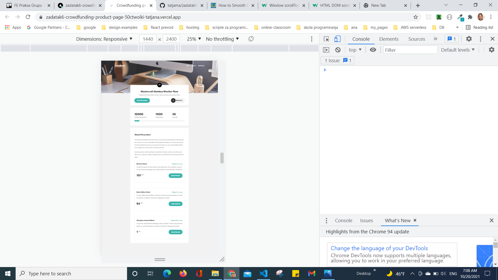
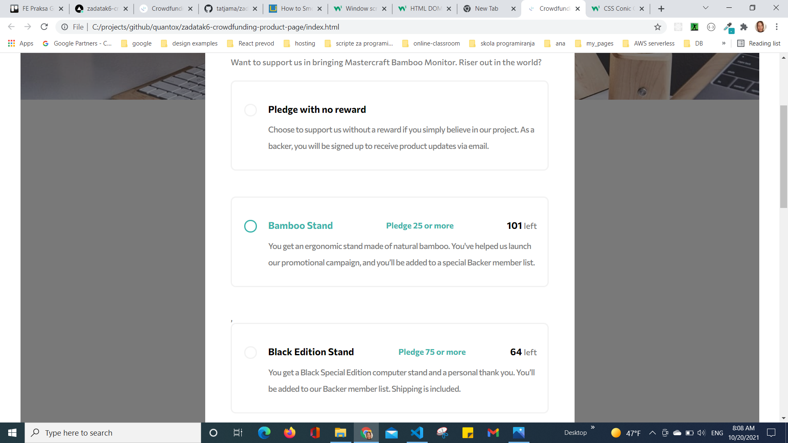
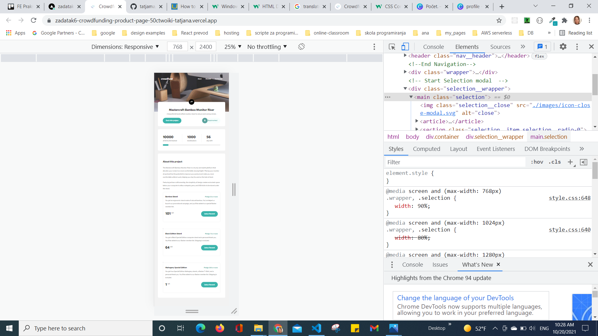
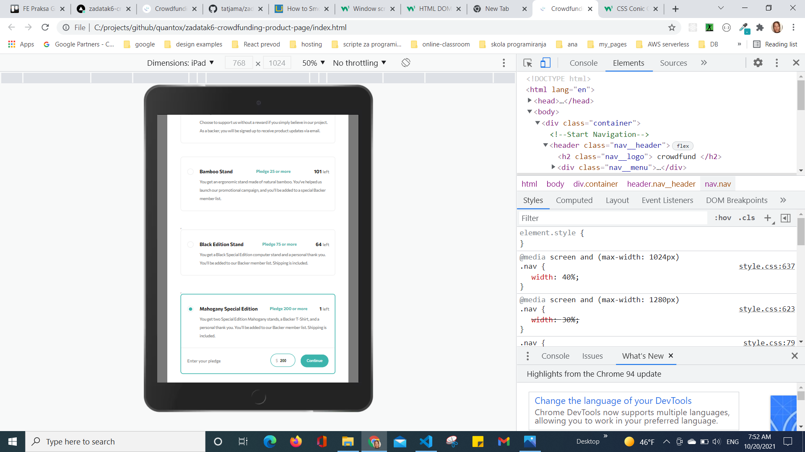
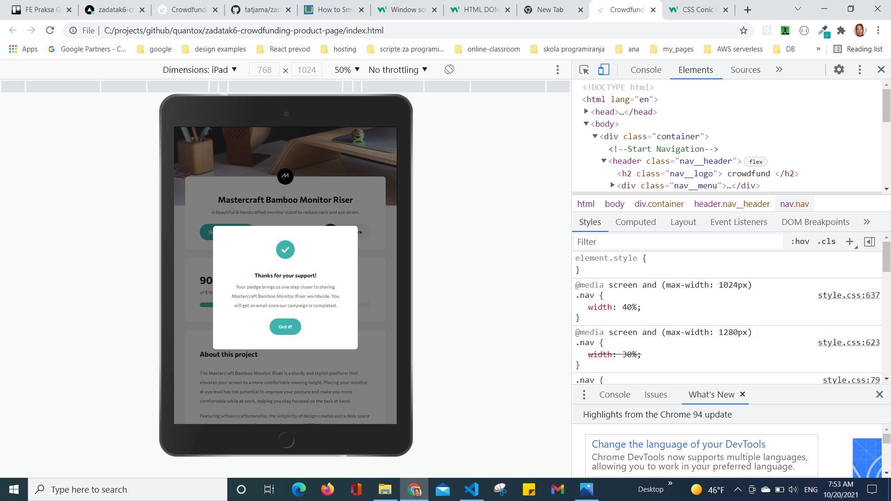
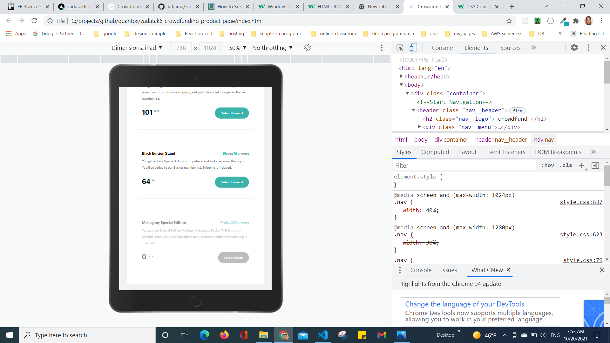
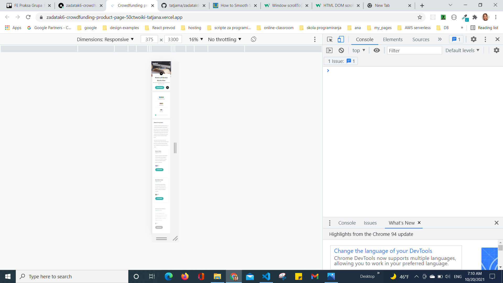
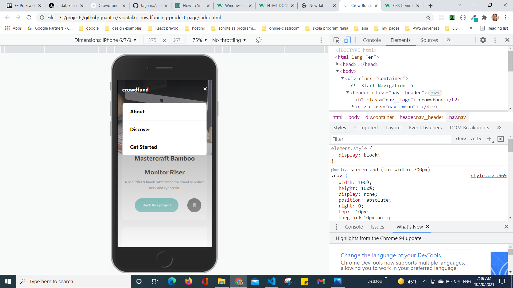
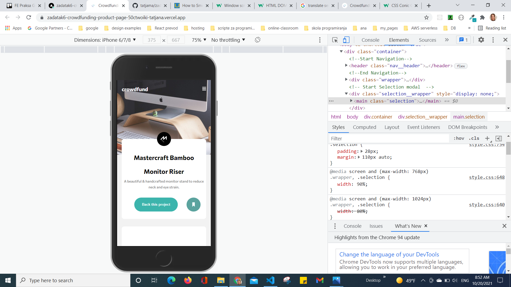
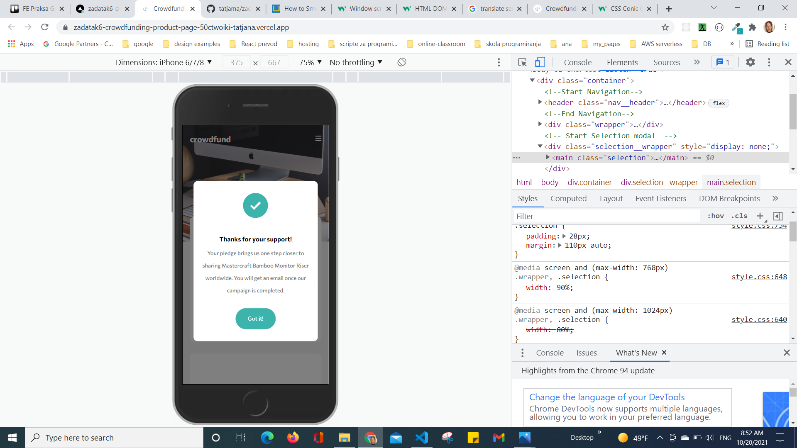

### Links

- Solution URL: [GitHub](https://github.com/tatjama/zadatak6-crowdfunding-product-page/tree/develop)
- Preview: [Vercel](https://zadatak6-crowdfunding-product-page-50ctwoiki-tatjana.vercel.app/)
- Live Site URL: [Vercel](https://zadatak6-crowdfunding-product-page.vercel.app/)

## My process

1. Create a new project
2. Import starting code
3. Initializing git repositories main and develop
4. Import git repositories to the Vercel project
5. Create HTML structure
6. Create CSS Utility
7. Style for Desktop
8. Create JavaScript Behavior for Pages
9. Responsive Mobile and Tablet style
10. Refactoring
11. Manual Test for bugs
14. Compare original designs with my work
15. Create screenshots
16. Change README-template.md to README.md
17. Open Pull request
18. Solve Issue
19. Merge develop branch into master branch
### Built with

1. Semantic HTML5 markup
2. CSS custom properties
- FlexBox
- Media queries
- Centering elements, content and text
- Element positioning
- Customize font,width and size
- Hover
- CSS variables
- z-index
- gradient
3. JavaScript
- DOM manipulation   
- Event handling
- Classes
## Author

- Website - [Tatjana Markovic](https://my-react-portfolio-tatjana.vercel.app/)
- LinkedIn - [Tatjana Marković](https://www.linkedin.com/in/tatjana-markovi%C4%87-919501189/)
- GitHub - [tatjama](https://github.com/tatjama)

